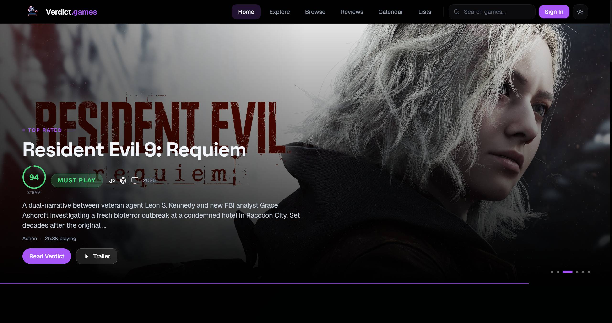
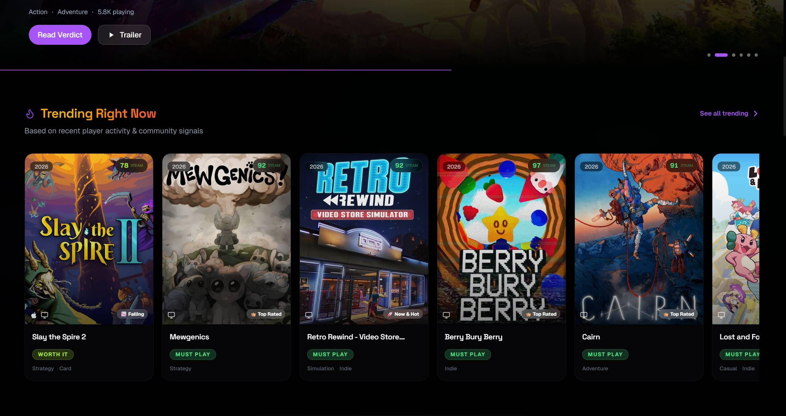
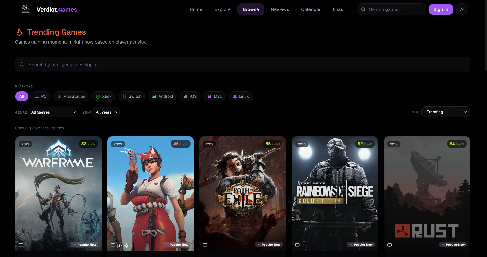

<div align="center">


# verdict.games

**The Verdict on Every Game**

A premium, data-driven game discovery and reviews platform.
Letterboxd for games — enriched with data from **9 external APIs** across all major platforms.

[**Visit Live Site**](https://www.verdict.games)


</div>

---

## Screenshots

| Homepage | Trending |
|----------|----------|
|  |  |
| Cinematic hero carousel with verdict scores | Live momentum tracking with verdict badges |

| Browse & Filter |
|-----------------|
|  |
| 11 platforms, genre, year, 6 sort modes — 8,200+ games |

---

## Features

### Data & Discovery
- **8,200+ games** with multi-source data from RAWG, Steam, IGDB, CheapShark, Wikipedia, HowLongToBeat & GX Corner
- **Auto-discovery** — Heroku scheduler discovers trending, new, and top-rated games daily
- **Multi-source scoring** — Verdict Score combines community reviews, critic ratings, and confidence metrics
- **Mobile store verification** — confidence-tiered matching against Google Play & App Store

### Pages & Navigation
- **Rich game pages** — verdict badges, pros/cons, pricing, trailers, achievements, news, Steam player reviews
- **Search & filter** — 11 platforms, genre, year, monetization, with full-text + RAWG fallback
- **Explore** — RAWG-powered curated lists: Most Anticipated, Best of 2025, All-Time Top 250, genre browsing
- **Game deals** — filterable deals page with store/genre filters, 4 sort modes, powered by GX Corner
- **Free-to-play** — free games + PS Plus / Game Pass subscription catalogs with tabbed browsing
- **Release calendar** — merged GX + database data with platform filters and month navigation
- **Curated lists** — 22 system-curated editorial lists with overlap enforcement and unique thumbnails
- **Game comparison** — side-by-side comparison with scores, stats, and HLTB data
- **Cross-navigation** — quick nav bar on deals/free-to-play pages for seamless page switching

### Community & Social
- **Community reviews** — user reviews with helpful voting + Steam player reviews integration
- **User profiles** — follow system, activity feed, review/list/library stats
- **User library** — personal backlog with status tracking (playing / completed / wishlist / dropped / paused)

### Admin & Operations
- **Admin dashboard** — full game editor, source-specific reingest (RAWG/IGDB), audit log with field-level diffs
- **Cron pipeline** — Heroku is the canonical recurring scheduler; dashboard/API triggers are manual fallbacks only

### Design
- **Responsive** — mobile-first with smooth horizontal scroll and native touch support
- **Dark / Light mode** — OLED-black dark theme with full light mode support
- **Animations** — Framer Motion scroll-reveal, animated gradient text, cinematic hero transitions

---

## Tech Stack

| Layer | Technology |
|-------|-----------|
| **Framework** | Next.js 16.1 (App Router, Turbopack) |
| **Language** | TypeScript 5 (strict mode) |
| **Styling** | Tailwind CSS v4 — 50+ custom design tokens |
| **Animation** | Framer Motion 12 |
| **Database** | Supabase (PostgreSQL 17) — RLS on all 21 tables, 32 migrations |
| **State** | TanStack React Query 5 |
| **Icons** | Lucide React |
| **Data Sources** | RAWG, Steam, IGDB/Twitch, CheapShark, Wikipedia, HLTB, GX Corner |
| **Hosting** | Vercel (frontend + API) · Heroku (scheduler) |
| **Analytics** | Vercel Analytics + Speed Insights |

---

## Architecture

```
┌─────────────────┐      ┌──────────────────┐      ┌─────────────────┐
│     Vercel       │─────▶│    Supabase      │◀─────│     Heroku      │
│   (Next.js 16)   │      │  (PostgreSQL 17)  │      │   (Scheduler)   │
│  Frontend + API  │      │   RLS + Auth     │      │   5 cron jobs   │
│  70+ routes      │      │   32 migrations  │      │                 │
└────────┬─────────┘      └──────────────────┘      └─────────────────┘
         │                         ▲
         ▼                         │
  ┌──────────────────────────────────────────┐
  │         9 External API Clients           │
  │                                          │
  │  RAWG · Steam · IGDB · CheapShark       │
  │  Wikipedia · HLTB · GX Corner            │
  │  Google Play · App Store                 │
  └──────────────────────────────────────────┘
```

---

## Getting Started

### Prerequisites

- **Node.js** 18+
- **npm** 9+
- A [Supabase](https://supabase.com) project (free tier works)
- [RAWG API key](https://rawg.io/apidocs) (free — 20K requests/month)
- [Twitch/IGDB credentials](https://dev.twitch.tv/console) (free — 4 req/sec)

### Quick Start

```bash
# 1. Clone & install
git clone https://github.com/Yogesh-VG0/VerdictGames.git
cd VerdictGames
npm install

# 2. Configure environment
cp .env.example .env.local
# Fill in: NEXT_PUBLIC_SUPABASE_URL, NEXT_PUBLIC_SUPABASE_ANON_KEY,
#          SUPABASE_SERVICE_ROLE_KEY, RAWG_API_KEY
# Optional: TWITCH_CLIENT_ID, TWITCH_CLIENT_SECRET, STEAM_API_KEY, CRON_SECRET

# 3. Bootstrap the database from ordered migrations
node scripts/apply-schema.mjs

# 4. Start dev server
npm run dev

# 5. Seed initial data
node scripts/ingest-full-library.mjs     # ~300 curated games
node scripts/seed-flags.mjs              # Set trending/featured flags
node scripts/seed-curated-lists.mjs      # Create the full 22 system-curated lists
```

### Scheduler Jobs (Heroku)

Heroku is the recurring scheduler authority. `vercel.json` intentionally leaves cron schedules disabled, and the admin dashboard only exposes manual fallback runs for lightweight jobs.

| Script | Frequency | Purpose |
|--------|-----------|---------|
| `heroku-refresh-trending.mjs` | Hourly | Update trending/featured flags via IGDB PopScore |
| `heroku-discover-games.mjs` | Daily | Discover new games from RAWG |
| `heroku-re-enrich.mjs` | Hourly | Re-enrich stale game data |
| `seed-curated-lists.mjs` | Daily | Refresh editorial list content |
| `backfill-games.mjs` | Hourly | Backfill historical game data |

---

## Project Structure

```
src/
├── app/                        # Next.js App Router
│   ├── page.tsx                # Homepage (hero carousel, 11 sections)
│   ├── admin/                  # Admin dashboard (games, reviews, users, audit)
│   ├── api/                    # 70+ REST API routes
│   │   ├── admin/              # Protected admin endpoints (21 routes)
│   │   ├── cron/               # Manual fallback cron endpoints (3 routes)
│   │   ├── games/              # Game data + deals/news/achievements
│   │   ├── gx/                 # GX Corner proxy (8 feeds)
│   │   └── ...                 # auth, search, reviews, lists, profile, etc.
│   ├── game/[slug]/            # Game detail (richest page)
│   ├── search/                 # Browse with 5 filter types
│   ├── explore/                # RAWG curated lists (5 tabs)
│   ├── calendar/               # Release calendar with merged month snapshots
│   ├── deals/                  # Game deals (GX Corner, filterable grid)
│   ├── free-to-play/           # Free games + subscription catalogs
│   ├── compare/                # Side-by-side game comparison
│   └── ...                     # reviews, lists, library, profile, settings
│
├── components/                 # 48 React components
│   ├── ui/                     # Primitives (ScoreRing, FilterChips, Skeleton, etc.)
│   ├── HeroCarousel.tsx        # Cinematic auto-advancing hero
│   ├── GameCard.tsx            # Default + spotlight variants
│   ├── GXPageNav.tsx           # Cross-navigation (Home/Deals/Free/Explore)
│   └── ...                     # ReviewCard, SteamReviews, AuthModal, etc.
│
├── lib/
│   ├── external/               # 9 API clients (RAWG, Steam, IGDB, etc.)
│   ├── services/               # Ingestion, homepage, search, calendar, GX feeds
│   ├── supabase/               # Database client + typed schema
│   ├── db/                     # Row mappers, column selections
│   └── utils/                  # Scoring, quality, trending, media readiness, public safety
│
├── hooks/                      # useAuth, useTheme
│
scripts/                        # 35 Node.js CLI scripts
supabase/                       # Derived schema snapshot + 32 ordered migrations
```

---

## Scoring Algorithm

> **Verdict Scoring v2** — a multi-signal composite score (0–100)

```
verdictScore = communityScore × 0.5 + criticScore × 0.3 + confidence × 20
```

| Signal | Weight | Source |
|--------|--------|--------|
| **Community Score** | 50% | Wilson Lower Bound of Steam positive/total reviews |
| **Critic Score** | 30% | Average of IGDB rating + RAWG Metacritic |
| **Confidence Bonus** | 20% | Up to 20 pts from review volume, source coverage, critic availability |

| Score Range | Verdict Label |
|-------------|---------------|
| 90 – 100 | **MUST PLAY** |
| 75 – 89 | **WORTH IT** |
| 50 – 74 | **MIXED** |
| 0 – 49 | **SKIP** |
| Future / Provisional | **COMING SOON** |

---

## Documentation

| Document | Description |
|----------|-------------|
| [**DOCUMENTATION.md**](./DOCUMENTATION.md) | Full technical docs — every file, API route, database table, component, and algorithm |
| [**BACKEND_SETUP.md**](./BACKEND_SETUP.md) | Supabase + Heroku deployment guide with all env vars, migrations, and admin setup |

---

## License

This is a personal project. All game titles, trademarks, and copyrights belong to their respective owners.
